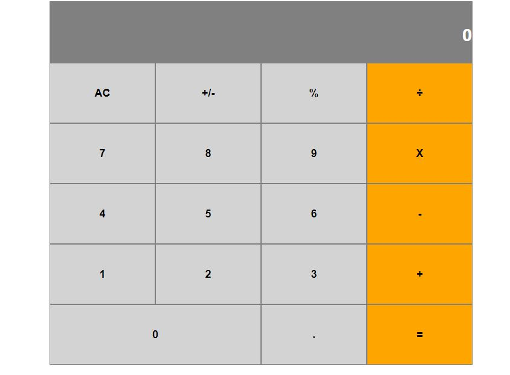

# Calculator-React

> This is a simple calculator app done by using react. This project was bootstrapped with [Create React App](https://github.com/facebook/create-react-app).



## Live Demo

- The live version of the app can be found [here](https://calculator-react-es6.herokuapp.com/)

## Built With

- React
- Javascript
- HTML, CSS

## Getting Started

To get a local copy up and running follow these simple example steps.

 - Clone this repository to your local machine using ```git clone git@github.com:DanielMitiku/calculator-react.git```.

 - Run ```cd calculator-react``` to move into the app directory.

 - Run ```npm install``` to install all the dependencies.

### `npm start`

Runs the app in the development mode.<br />
Open [http://localhost:3000](http://localhost:3000) to view it in the browser.

## Author

👤 **Daniel Mitiku**

- Github: [@danielmitiku](https://github.com/DanielMitiku)

## 🤝 Contributing

Contributions, issues and feature requests are welcome!

Feel free to create PR.

## Show your support

Give a ⭐️ if you like this project!

## 📝 License

This project is [MIT](lic.url) licensed.
